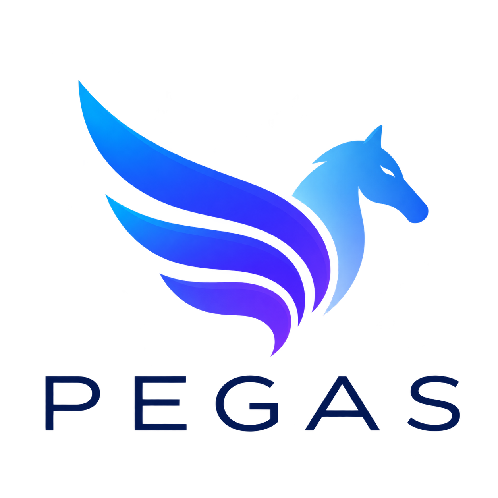

<p align="center">
  
</p>

<h1 align="center">Pegas</h1>

<p align="center">
  <b>A self-hosted multi-agent system that can pay for expertise, but only within bounded authority.</b><br/>
  Own open-weight model · multi-agent workflow · x402 payments on Solana Devnet · MCP server for other AI agents
</p>

<p align="center">
  <a href="https://pegas-rouge.vercel.app"><b>Live demo</b></a> ·
  <a href="https://pegas-rouge.vercel.app/vision">Vision</a> ·
  <a href="https://pegas-rouge.vercel.app/build">Guide</a> ·
  <a href="https://pegas-rouge.vercel.app/blog">Blog</a> ·
  MCP endpoint: <code>https://pegas-rouge.vercel.app/api/mcp</code>
</p>

---

## The idea

Teaching an AI agent to pay is easy. The hard problem is defining exactly **when** it may pay, **whom** it may pay, **how much** authority it has, and **how anyone can prove** what happened afterward.

Pegas is a working, public prototype of that idea:

- **Own model.** All agents run on a self-hosted open-weight model (Qwen3 4B) on a serverless GPU that scales to zero. No hosted LLM API. *Not your model, not your data.*
- **Multi-agent workflow.** A request desk with Intake, Privacy, Routing, Reviewer and a paid Legal Advisor, with visible handoffs.
- **Agentic payments with bounded authority.** When Routing decides that a Legal consultation is needed, Pegas buys it for **0.01 test USDC** over **x402** on **Solana Devnet**. Every payment passes a mandate, an identity check and 10 deterministic policy controls, and leaves on-chain evidence.
- **MCP server.** External AI agents (Claude, Cursor, any MCP client) can call Pegas. They get a **tool, not authority**: they cannot sign, hold keys, or change price, seller, network or token.

The governance model is inspired by Lead's September 2026 framework for agentic finance. Pegas implements a small, practical subset of these ideas. It is not a full implementation of that framework.

---

## Try it

### 1. On the website

Open **[pegas-rouge.vercel.app](https://pegas-rouge.vercel.app)** and choose:

| Mode | What happens |
|---|---|
| **Standard request** | Free. Agents classify and route a fictional request. Nothing is spent. |
| **Paid Legal** | Routing may buy one Legal consultation. You watch the mandate, the 10 policy checks, the x402 payment, the Solana confirmation and the Legal answer. |
| **AI agent via MCP** | A small MCP client in your browser plays an external AI agent. It discovers the Pegas tools and calls them over real JSON-RPC. You see the agent ↔ Pegas transcript on the left and the agents at work on the right. |

Tip: press **Wake model** first. The GPU scales to zero, so the first call after idle can take up to a minute.

### 2. From your own AI assistant (MCP)

In Claude: **Customize → Connectors → Add custom connector**, paste the URL below and choose no sign-in.

```
https://pegas-rouge.vercel.app/api/mcp
```

Then, in a new chat:

> Use the Pegas request_legal_consultation tool. Set agent_name to "Claude". Request: "We need a legal review of a contract clause before signing. Our vendor NDA allows the vendor to use our shared information to train its AI models and to keep it for 5 years after the agreement ends. What should we ask to change?"

In the Claude app and on claude.ai, the result appears as an interactive **Pegas receipt** card (MCP App): the delegation chain, the policy checks, the payment, the evidence and the Legal verdict. Text-only clients get the same data as text and JSON.

---

## Architecture

```text
Browser / external AI agent (MCP)
        │
        ▼
Next.js on Vercel
  ├─ /api/workflows/run   web workflow (SSE stream of workflow events)
  ├─ /api/mcp             MCP server (Streamable HTTP, stateless)
  └─ /api/model/warmup    optional GPU pre-warm
        │
        ▼
Deterministic TypeScript orchestrator
  Intake → Privacy (conditional) → Routing → [paid branch] → Reviewer
        │                                         │
        ▼                                         ▼
Modal (serverless GPU, scale to zero)      Agentic payment path
  Ollama → qwen3:4b → NVIDIA L4             Mandate → KYA-lite → 402 quote (frozen)
                                            → AUTH-01..10 → server-side signer
                                            → x402 facilitator → Solana Devnet
                                            → Alchemy evidence → mandate consumed
                                            → Legal Advisor → Reviewer
```

### Agents

| Agent | Role |
|---|---|
| Intake | Structures the request, sets priority and confidentiality |
| Privacy | Runs only when needed. Reduces what is forwarded and withholds sensitive fields |
| Routing | Chooses Technical, Business, Finance or Legal. In paid mode it may *request* a Legal consultation |
| Legal Advisor | Paid specialist. Runs only after confirmed on-chain payment |
| Reviewer | Approves, asks for one bounded revision, or sends the result to manual review |

The orchestrator is ordinary deterministic code. All agents share the same self-hosted model. **There is no "payment agent" LLM.** The model can ask for a capability, but it never holds spending authority.

### Bounded authority

Effective authority is the **intersection** of every constraint. No agent, seller or external caller can expand it.

| Control | Rule |
|---|---|
| AUTH-01 | Payment feature is on and the mandate is active |
| AUTH-02 | Mandate is not expired and enough time remains to settle and verify |
| AUTH-03 | Service scope is `legal_consultation` only |
| AUTH-04 | Seller is registered in KYA-lite and its wallet matches the bound identity |
| AUTH-05 | Network is Solana Devnet only |
| AUTH-06 | Asset is the configured Devnet test USDC only |
| AUTH-07 | Amount is exactly 10000 atomic units (0.01 test USDC) |
| AUTH-08 | One authorization per mandate, no more |
| AUTH-09 | Quote is bound to the expected resource, and privacy restrictions allow the handoff |
| AUTH-10 | Session, hourly and daily budget reservation succeeds (atomic, in Redis) |

Other invariants:

- **Frozen first 402.** The first valid x402 `PAYMENT-REQUIRED` challenge is frozen, checked and signed as the same object. There is no second unpaid request between approval and signing.
- **Independent evidence.** Facilitator success is not enough. Pegas confirms the transfer on-chain through Alchemy (payer, recipient, mint, amount, finality) before the Legal Advisor runs.
- **Separate states.** "Payment declined", "payment confirmed + Legal failed" and "payment confirmed + Reviewer failed" are reported separately. A confirmed payment is never retried.
- **Narrow Redis.** Upstash Redis holds payment-side state only: idempotency, reservations, budgets, receipts. It is not a workflow database or agent memory.

### MCP server

| Tool | What it does | Cost |
|---|---|---|
| `submit_request` | Runs the free standard workflow | Free |
| `request_legal_consultation` | Runs the paid workflow. If Routing selects Legal, Pegas buys one consultation | 0.01 test USDC |
| `get_payment_evidence` | Returns stored mandate, policy and settlement evidence | Free, read-only |

- The mandate records the caller honestly: `principal_id: mcp-external-agent` (self-declared, not verified).
- All external agents share one narrower budget lane.
- Progress notifications stream live (`_meta["pegas/step"]`, step fields only, never payloads).
- The two workflow tools link to an MCP App resource, `ui://pegas/receipt`, rendered as an inline card in MCP Apps hosts.

---

## Tech stack

| Layer | Technology |
|---|---|
| Frontend + API | Next.js 16, React 19, TypeScript, Tailwind CSS 4, Vercel |
| Model runtime | Modal (serverless GPU, scale to zero), Ollama, Qwen3 4B, NVIDIA L4 |
| Payments | x402 V2 (`exact`, upfront) via `@x402/core` + `@x402/svm`, `@solana/kit`, Solana Devnet, test USDC |
| Chain evidence | Alchemy Solana RPC |
| Payment state | Upstash Redis (REST) |
| MCP | `mcp-handler` 2.x + `@modelcontextprotocol/server` 2.x, MCP Apps (`@modelcontextprotocol/ext-apps` browser bundle) |

---

## Repository map

```text
app/
  page.tsx                     Demo (home)
  vision/  build/  blog/       Vision, Guide, Blog pages
  api/workflows/run/           Web workflow endpoint (SSE)
  api/mcp/                     MCP server endpoint
  api/model/warmup/            GPU pre-warm proxy
  api/paid-services/legal-consultation/   x402-protected seller endpoint
  api/payments/receipt/        Receipt re-check for the web UI
components/                    UI: workflow graph, payment timeline, inspector, MCP panel…
lib/workflow/                  Orchestrators, prompts, schemas, privacy, Legal Advisor
lib/payments/                  Mandate, KYA-lite registry, AUTH policy, x402 client/server, evidence, Redis ledger
lib/mcp/                       MCP tools, browser MCP client, receipt card (MCP App)
modal-poc/modal-poc/app.py     Modal GPU runtime (Ollama + qwen3:4b)
scripts/                       Test suites and payment setup checks
docs/                          Early design notes (historical)
```

---

## Run locally

Requirements: Node.js 22 (see `.nvmrc`), npm, and a deployed Modal runtime if you want real model calls.

```bash
npm ci
cp .env.example .env.local    # then fill in values
npm run dev                   # http://localhost:3000
```

### Environment variables

All values are **server-side only**. Never put secrets into `NEXT_PUBLIC_*` variables.

| Group | Variables |
|---|---|
| Model | `MODEL_BASE_URL`, `MODEL_AUTH_TOKEN`, `OLLAMA_MODEL`, `GPU_LABEL` |
| Payments switch | `AGENTIC_PAYMENTS_ENABLED` (`false` by default) |
| x402 / Solana | `X402_FACILITATOR_URL`, `SOLANA_NETWORK`, `SOLANA_USDC_MINT`, `SOLANA_RPC_URL` |
| Wallets | `PAYMENT_BUYER_PRIVATE_KEY` (dedicated Devnet hot key), `PAYMENT_BUYER_ADDRESS`, `LEGAL_PAY_TO` (public address only) |
| Seller service | `LEGAL_SERVICE_BASE_URL`, `LEGAL_SERVICE_AUTH_SECRET` |
| Limits | `LEGAL_CONSULTATION_AMOUNT_ATOMIC`, `PAYMENT_MAX_PER_OPERATION_ATOMIC`, `PAYMENT_MAX_PER_SESSION_ATOMIC`, `PAYMENT_MAX_DAILY_ATOMIC`, `PAYMENT_MAX_AUTHORIZATIONS_PER_HOUR` |
| Payment state | `UPSTASH_REDIS_REST_URL`, `UPSTASH_REDIS_REST_TOKEN` |

The standard workflow needs only the model variables. Paid mode stays off unless `AGENTIC_PAYMENTS_ENABLED=true` and the whole payment configuration validates.

### Model runtime (Modal)

```bash
cd modal-poc/modal-poc
modal deploy app.py
```

Deploy Modal only when `app.py` changes. If a change touches both Modal and the web app, deploy Modal first.

### Tests

```bash
npm run test:phase2               # correction loop
npm run test:phase3               # privacy
npm run test:phase4:routing
npm run test:phase4:evaluation
npm run test:payments:all         # policy, protocol, workflow
npm run lint
npm run build
```

`npm run payments:live-smoke` performs a real Devnet payment and needs explicit opt-in.

### Deployment

`git push` to `main` → GitHub → Vercel builds and deploys. Modal is deployed separately (see above).

---

## What is real, and what is demo

**Real:** self-hosted model inference on a GPU, the multi-agent workflow, x402 V2 settlement, on-chain transfers on Solana Devnet, Alchemy verification, the MCP server and the MCP App card.

**Demo boundary:**
- test USDC on **Devnet only**, never mainnet or real funds;
- KYA-lite is a small fixed registry, and external MCP callers are **not verified**;
- the MCP endpoint is public, with no sign-in, and is protected by fixed amounts and budgets;
- the Legal Advisor applies a 3-rule demo policy and gives **no legal advice**;
- the buyer key is a dedicated Devnet hot key in server env. Real-value use would need KMS/HSM/MPC signing and verified agent identity.

---

## Field notes

The [blog](https://pegas-rouge.vercel.app/blog) tells how Pegas was built, including what broke:

1. How We Ran an Open-Source LLM on a Cloud GPU
2. When the Demo Worked — and Then Everything Broke
3. Making a Self-Hosted LLM Easy to Restart Was Harder Than Running It
4. Why Does Running an Open Model Cost So Much?
5. The Day Pegas Stopped Needing a GPU Babysitter
6. From One Model Call to a Multi-Agent System
7. From AI Workflow to Agentic Finance: How Pegas Learned to Pay for Expertise
8. Pegas Became an MCP Server: Other Agents Get a Tool, Not Authority

---

## Author

Built by **Leonid Khatskevych**, product owner. Architecture, decisions and review are human-led, and the code was written with AI coding agents.

[Personal page](https://personal-landing-leonid-khatskevych.vercel.app/)
